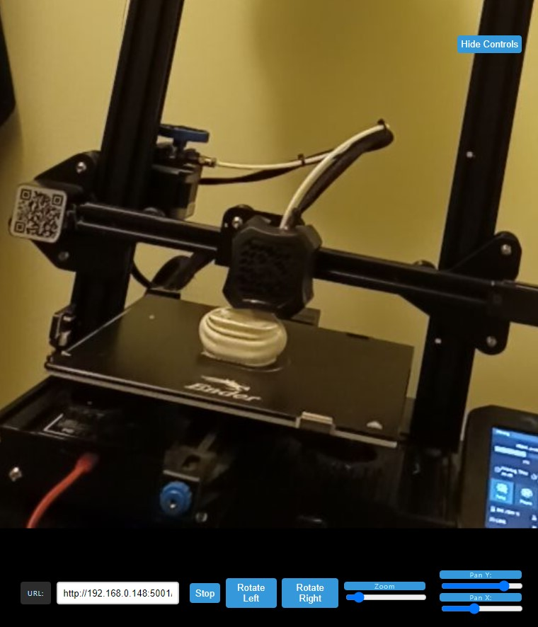

# Online-Mjpeg-Viewer
A simple website to view mjpeg streams. Contains controls to rotate, zoom and pan on the video.

## Why?
I wanted a simple website to watch my 3d Printer's octoprint stream with zoom/pan controls. Couldn't really find what I was looking for.

## How to use:

This website is not hosted anywhere due to problems with https and cors. Browsers do not allow the website to get information from private http streams.

Simply download the code and open up index.html or serve the website locally so that you can view from any device within your network (this is faily simple to do, look up local host serving).

 
## Interface

